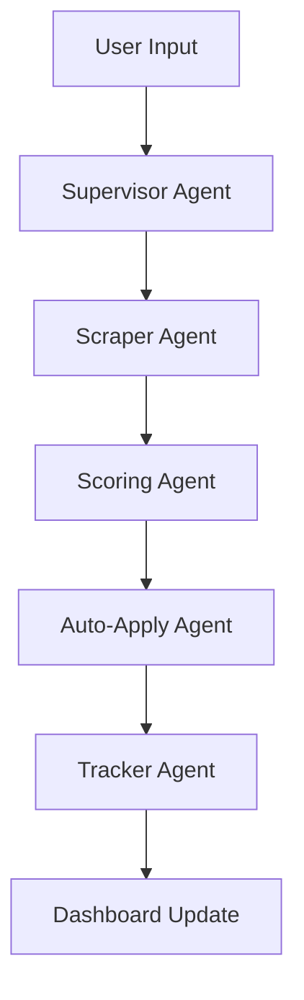

# SkillNavigator - AI-Powered Multi-Agent Job Application Platform

## 🎯 Overview

SkillNavigator is an intelligent job application automation platform that uses AI-powered agents to streamline the job search process for college students and early professionals. The system automatically scrapes job listings, scores them based on user preferences and qualifications, and can even auto-apply to relevant positions.

## 🤖 Multi-Agent Architecture

The platform consists of 5 autonomous agents:

1. **Scraper Agent**: Automatically scrapes job listings from LinkedIn, Indeed, Internshala, and other job portals
2. **Scoring Agent**: Uses AI to match jobs with user profiles and assigns relevance scores
3. **Auto-Applying Agent**: Automatically fills out job applications and generates personalized cover letters
4. **Application Tracker Agent**: Tracks application status and maintains a comprehensive application history
5. **Supervisor Agent**: Orchestrates all agents using LangGraph-style workflow management

## 🛠️ Tech Stack

- **Frontend**: React + Vite + Tailwind CSS
- **Backend**: Python FastAPI
- **AI/LLM**: OpenAI API with LangChain
- **Scraping**: Playwright for dynamic content
- **Database**: SQLite for local storage
- **Deployment**: Localhost-ready, Vercel/Railway compatible

## 📋 Features

- **Smart Job Matching**: AI-powered semantic matching between jobs and user profiles
- **Automated Application**: One-click application to multiple jobs
- **Personalized Cover Letters**: AI-generated cover letters tailored to each job
- **Application Tracking**: Comprehensive dashboard to track all applications
- **Weekly Job Updates**: Automated scraping on schedule
- **User-Friendly Dashboard**: Clean, intuitive interface for managing preferences

## 🚀 Installation

### Prerequisites

- Python 3.8+
- Node.js 16+
- OpenAI API Key

### Backend Setup

1. Clone the repository:
```bash
git clone <repository-url>
cd skillnavigator
```

2. Create virtual environment:
```bash
python -m venv venv
venv\Scripts\activate  # Windows
# source venv/bin/activate  # Linux/Mac
```

3. Install Python dependencies:
```bash
pip install -r requirements.txt
```

4. Set up environment variables:
```bash
copy .env.example .env
# Edit .env file with your API keys
```

5. Initialize database:
```bash
python backend/database/db_connection.py
```

6. Start the backend server:
```bash
cd backend
python main.py
```

### Frontend Setup

1. Navigate to frontend directory:
```bash
cd frontend
```

2. Install dependencies:
```bash
npm install
```

3. Start development server:
```bash
npm run dev
```

## 🔧 Configuration

### Environment Variables

Create a `.env` file in the root directory:

```env
OPENAI_API_KEY=your_openai_api_key_here
DATABASE_URL=sqlite:///./skillnavigator.db
SCRAPING_DELAY=2
MAX_JOBS_PER_SEARCH=50
LOG_LEVEL=INFO
```

### User Profile Setup

1. Navigate to the Settings page in the dashboard
2. Upload your resume (PDF format)
3. Set job preferences (location, role, salary range, etc.)
4. Configure auto-application settings

## 📖 Usage

### Starting the System

1. Launch both backend and frontend servers
2. Open `http://localhost:5173` in your browser
3. Complete your profile setup in Settings
4. Navigate to Dashboard to start job searching

### Manual Job Search

1. Go to the Home page
2. Enter search criteria (keywords, location, etc.)
3. Click "Search Jobs" to trigger the Scraper Agent
4. View scored results in the Dashboard
5. Select jobs to apply to automatically

### Automated Mode

1. Enable "Auto Mode" in Settings
2. Set your preferred schedule (daily/weekly)
3. The Supervisor Agent will automatically:
   - Scrape new jobs
   - Score them against your profile
   - Apply to high-scoring positions
   - Update your application tracker

## 🗂️ Project Structure

```
skillnavigator/
├── README.md
├── .env.example
├── requirements.txt
├── backend/
│   ├── main.py                 # FastAPI entry point
│   ├── routes/                 # API endpoints
│   ├── agents/                 # AI agent implementations
│   ├── utils/                  # Helper utilities
│   └── database/               # Database models and connection
├── frontend/
│   ├── src/
│   │   ├── components/         # Reusable UI components
│   │   └── pages/              # Application pages
│   └── public/                 # Static assets
└── data/                       # Sample data and user profiles
```

## 🤝 API Endpoints

### Jobs
- `GET /api/jobs/search` - Search and scrape jobs
- `GET /api/jobs/scored` - Get scored job matches
- `POST /api/jobs/apply` - Auto-apply to selected jobs

### User
- `POST /api/user/profile` - Update user profile
- `GET /api/user/preferences` - Get user preferences
- `POST /api/user/resume` - Upload resume

### Tracker
- `GET /api/tracker/applications` - Get application history
- `PUT /api/tracker/status` - Update application status
- `GET /api/tracker/stats` - Get application statistics

## 🔒 Privacy & Security

- All data stored locally in SQLite database
- Resume data encrypted at rest
- No sensitive information sent to third-party services
- User can delete all data at any time

## 🐛 Troubleshooting

### Common Issues

1. **Scraping Blocked**: Some sites may block automated requests
   - Solution: Adjust scraping delays in settings
   - Use residential proxies if needed

2. **API Rate Limits**: OpenAI API usage limits
   - Solution: Implement request queuing and retry logic
   - Monitor usage in dashboard

3. **Application Failures**: Auto-application not working
   - Solution: Check site structure changes
   - Update selectors in scraper helpers

## 📈 Future Enhancements

- Integration with more job portals
- Advanced ML models for better job matching
- Company research automation
- Interview scheduling integration
- Salary negotiation insights
- Performance analytics dashboard

## 🤖 Agent Workflow



## 📞 Support

For issues, feature requests, or contributions, please open an issue in the repository or contact the development team.

## 📄 License

This project is licensed under the MIT License. See LICENSE file for details.
